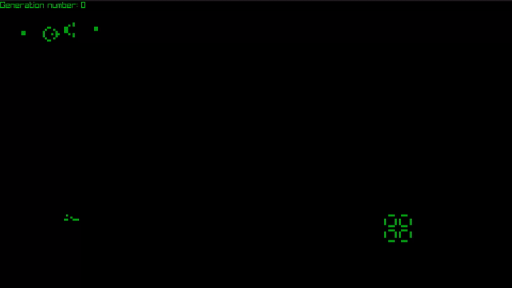

# Cellular Automata

C++17 cellular automaton simulator rendered with raylib. Implements Conway's Game of Life (B3/S23), Seeds (B2/S), High Life (B36/S23), Maze (B3/S12345), and Diamoeba (B35678/S5678) behind a common `cellular_automaton` interface.



Full video on YouTube: [https://youtu.be/SsfAH9yT1z0
](https://www.youtube.com/watch?v=_RjSH6VHFto)

## Requirements

- C++17 compiler (`clang++`)
- raylib (`brew install raylib` on macOS)
- `pkg-config`

## Build

```sh
make
```

## Run

```sh
make go
# or
./game [automaton] [pattern]
```

`automaton`: `game_of_life`, `seeds`, `high_life`, `maze`, `diamoeba`
`pattern`: `acorn`, `pulsar`, `default_scenario`, `glider_gun`, `random`, `all_colored_board`, `diehard`, `r_pentomino`, `rabbits`, `replicator`, `replicator_field` (High Life only), `showcase`

Run without arguments to be prompted for both interactively.

## Controls

- Hold left mouse button: draw live cells under the cursor
- Space: pause/resume

## Structure

```
src/
├── main.cpp                    # window init, main loop
├── board.h / board.cpp         # grid storage (flat int vector), bounds-checked get/set
├── cellular_automaton.h / .cpp # interface: update(board&), neighbours()
├── automata/
│   ├── game_of_life.h / .cpp
│   ├── seeds.h / .cpp
│   ├── high_life.h / .cpp
│   ├── maze.h / .cpp
│   └── diamoeba.h / .cpp
├── renderer.h / renderer.cpp   # draws the board
├── input.h / input.cpp         # mouse/keyboard handling
└── initial_conditions.h / .cpp # starting patterns (Acorn, Pulsar, default scenario, glider gun, random)
```

Each `update()` reads from the board and writes to a separate copy, which is then swapped in, so all cells update against the same previous-generation state.
